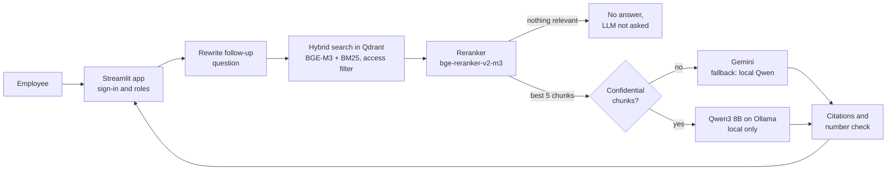

# CIA · Corporate Information Assistant

A retrieval-augmented generation (RAG) assistant that answers employees' questions from company
documents, cites the passages it used, respects who may see what, and keeps confidential documents
on the company's own machines.

Built step by step as a learning project for a fictional company, *Kalkan Siber Güvenlik A.Ş.*
The documents, people, customers and numbers in it are all made up. The interface and the
documents are in Turkish; the code is in English.

## What it does

- **Reads real-world documents:** PDF (including scanned pages, with OCR), Word, PowerPoint
  (with speaker notes), Excel, CSV and HTML. Tables keep their headers; headers and footers are removed.
- **Chunks by structure:** along headings, measured in tokens of the embedding model; each chunk
  starts with `[file > heading path]`.
- **Knows each document:** a catalog sets the access level (`internal` or `restricted`), whether a
  document is current or superseded, and its effective date.
- **Hybrid search:** meaning (BGE-M3 embeddings) and keywords (BM25 with a Turkish-aware tokenizer
  for codes like `VPN-ERR-301` or `M-1014`), fused with Reciprocal Rank Fusion inside Qdrant. The
  access filter is applied to both searches.
- **Reranking:** a cross-encoder (bge-reranker-v2-m3) reads the question with each of 20 candidates
  and keeps the 5 most relevant. When nothing is relevant enough, the LLM is not asked at all.
- **Conversations:** a follow-up question ("Peki yöneticiler için?") is rewritten into a standalone
  question before the search.
- **Answers with citations:** every statement cites its sources (`[1]`, `[2][3]`); an answer the
  documents do not contain is marked as such. Numbers and codes in the answer are checked against the
  sources it cites, and the interface warns about the ones it cannot find.
- **Roles and confidentiality:** sign-in with salted scrypt password hashes, four roles, document
  management for admins only. Chunks labelled `restricted` are only ever sent to the local model;
  if it is down, there is no answer rather than a fallback to the cloud.
- **Evaluation:** 49 questions (facts, tables, codes, negations, recency, permissions, unanswerable
  and off-topic questions, follow-ups) checked for retrieval, answer phrases, an LLM judge,
  security and citations. Runs are saved and compared question by question.
- **Question log:** who asked what, what was found and what went wrong (not the answers), with a
  report of the questions the documents could not answer.

## Architecture



Two machines:

| Machine | Runs |
|---|---|
| Application computer | Streamlit app, scripts, Qdrant (Docker) |
| GPU server (RTX A5000), over VPN | `model_server/` (FastAPI: embeddings and reranking), Ollama with `qwen3:8b` |

Gemini is reached over the internet through its OpenAI-compatible API. Every LLM call goes through
`rag/llm.py`, which routes each task (`answer`, `rewrite`, `judge`) to its providers in order.

## Project layout

```
app.py                  web interface (Streamlit); every text on screen is in ui_texts.toml
config.py               all settings; secrets come from .env
document_catalog.toml   access level, status and date of every document
rag/
  reader.py, tabular.py document reading (Docling, openpyxl, BeautifulSoup)
  chunker.py            heading-aware chunking
  metadata.py           the document catalog
  indexer.py, store.py  indexing into Qdrant (dense + sparse vectors), folder sync
  sparse.py             BM25 for Turkish text and company codes
  retriever.py          hybrid search and reranking
  rewriter.py           follow-up question -> standalone question
  answer.py             prompt, routing of confidential content, the answer
  citations.py          citation parsing, source excerpts, number and code verification
  llm.py                single entry point for LLM calls, with fallback
  model_client.py       client of the model server
  auth.py               users, password hashes, roles
  evaluation.py         the checks of the evaluation
  query_log.py          question log
scripts/                command-line tools (indexing, asking, evaluation, checks)
evaluation/questions.toml   the evaluation question set
model_server/           the model server for the GPU machine
```

## Setup

### 1. GPU server

```bash
cd model_server
pip install -r requirements.txt          # install PyTorch with CUDA first
cp .env.example .env                     # set MODEL_SERVER_API_KEY
uvicorn server:app --host 0.0.0.0 --port 8001
python smoke_test.py                     # embeddings and reranking answer
ollama pull qwen3:8b
```

Ports 8001 and 11434 must only be reachable from the VPN: Ollama has no authentication.

### 2. Application computer

Python 3.11 or later, and Docker for Qdrant.

```bash
python -m venv .venv && source .venv/bin/activate     # Windows: .venv\Scripts\activate
pip install -r requirements.txt
cp .env.example .env                                  # fill in the keys and addresses
docker compose up -d                                  # Qdrant on 127.0.0.1:6333
```

Put the documents in `data/samples/` and describe them in `document_catalog.toml` (a document
missing from the catalog is treated as `restricted`). Then:

```bash
python -m scripts.index_documents                          # index (later runs only update changes)
python -m scripts.manage_users add admin --role admin      # the first user; the password is asked
streamlit run app.py
```

## Command-line tools

| Command | What it does |
|---|---|
| `python -m scripts.ask "question" [--role manager] [--history "earlier question"] [--show-context]` | ask from the terminal |
| `python -m scripts.index_documents [--dry-run] [--recreate]` | sync the documents folder with Qdrant |
| `python -m scripts.manage_users add/passwd/role/remove/list` | users of the web app |
| `python -m scripts.evaluate --label NAME` | run the evaluation (`--retrieval-only` is free: no LLM) |
| `python -m scripts.compare_eval --last 2` | compare two evaluation runs question by question |
| `python -m scripts.check_access` | roles, filters and confidential routing |
| `python -m scripts.check_rerank` | reranker ranks and scores; checks `RERANK_MIN_SCORE` |
| `python -m scripts.check_hybrid` | BM25 tokenizer and dense / sparse / hybrid ranks |
| `python -m scripts.check_verification` | the number and code check on made-up answers |
| `python -m scripts.show_log [--last 20]` | summary of the question log |

## Security notes

- Secrets live only in `.env` files, which are not committed.
- `data/` (documents, extracted text, cache, users, question log) and `evaluation/results/`
  (answers with document text) are not committed either: protect them like the documents.
- The app and Qdrant listen on localhost only. Do not open the app to a network without HTTPS
  (a reverse proxy) in front of it.
- Uploading documents is for admins only: a document is also a way to inject instructions into the
  LLM's context.
- With the Gemini free tier, Google may use the data it receives. That is why restricted content
  never leaves the GPU server, and why the evaluation judge does not see confidential answers.

## Known limitations

- Counting or summing rows of a table ("how many active customers?") needs a table query tool
  (an agent), not text search.
- OCR of low-quality scans can lose lines; answers based on scanned pages say so.
- The document set is small; on thousands of documents the chunk size, the number of candidates
  and the reranker threshold should be measured again (`scripts/check_rerank.py`, `scripts/evaluate.py`).
